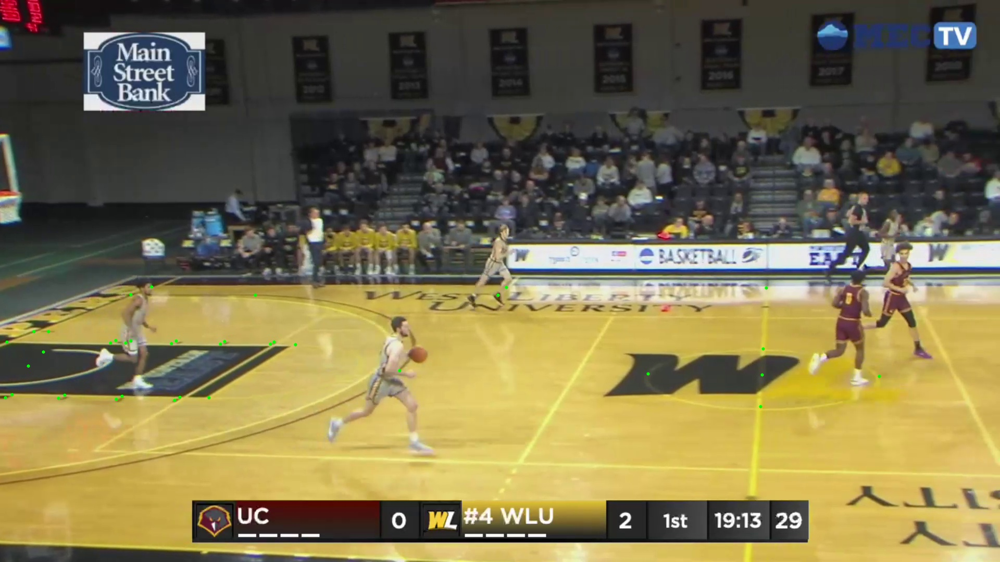
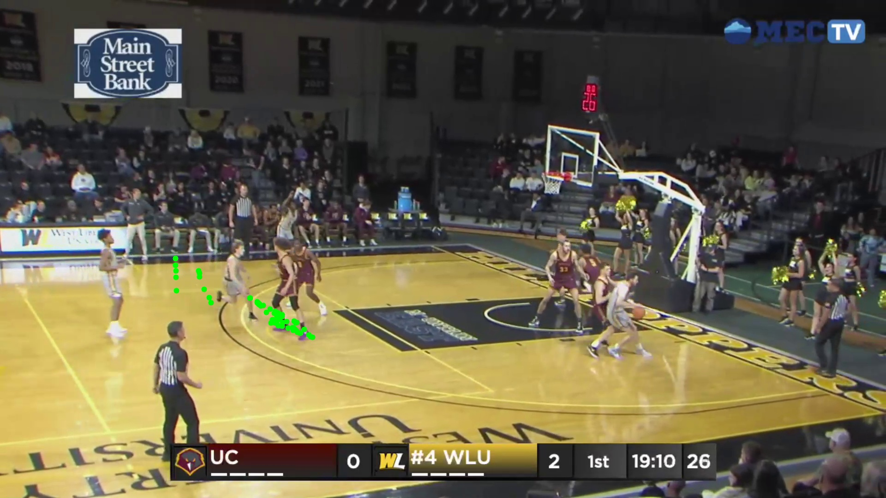

# KaliCalibNet

KaliCalibNet is a neural network model for basketball court calibration and keypoint (grid + baskets) detection.  
It is **an implementation** of the architecture presented in [KaliCalib: A Framework for Basketball Court Registration](https://arxiv.org/abs/2209.07795) by Adrien Maglo, Astrid Orcesi, and Quoc Cuong Pham.

My implementation is part of a larger project to get more advanced analytics for smaller college basketball programs. I am particuarly focused on the Division II Mountain East Conference. 

### Example output


This repository includes:
- **Model Architecture** (`src/models/network.py`)
- **Custom Non-Local Block** (`src/models/layers.py`)
- **Dataset Processing & Augmentations** (`src/data/`)
- **Loss Functions** (`src/training/losses.py`)
- **Court Utilities** (homography, geometry, etc.) in (`src/utils/court.py`)
- **Training Script** (`scripts/train.py`)
- **Inference Script** (`scripts/inference.py`)
- **Config** (`configs/default.yaml`)
- **Heatmap Generation** (`scripts/generate_single_heatmap.py`)

---

## Table of Contents

1. [Project Overview](#project-overview)
2. [Installation & Environment Setup](#installation--environment-setup)
3. [Data Structure & Preparation](#data-structure--preparation)
4. [Data Labeling (with Video Demonstration)](#data-labeling-with-video-demonstration)
5. [Training](#training)
6. [Inference / Testing](#inference--testing)
7. [Scripts Overview](#scripts-overview)
8. [Configuration Options](#configuration-options)

---

## Project Overview

**KaliCalibNet** uses a ResNet-18 backbone, modified with dilated convolutions and optional Non-Local Blocks for capturing longer-range dependencies in the spatial dimension. It is designed to:
1. Ingest an RGB image of a basketball court.
2. Predict a (K+1)-channel heatmap, where each channel corresponds to:
   - 91 grid point positions (perspective-aware or uniformly spaced),
   - 1 channel for the upper basket (UB),
   - 1 channel for the lower basket (LB),
   - and 1 for the background.
3. Enable further homography-based transformations to register the court with real-world coordinates.

---

## Data Structure & Preparation

The code expects your dataset directory to be structured as follows:
```
data/
├── train/
│   ├── images/
│   │   ├── example_1.jpg
│   │   ├── example_2.jpg
│   │   └── ...
│   └── labels/
│       ├── example_1.npz
│       ├── example_2.npz
│       └── ...
└── val/
    ├── images/
    │   ├── val_1.jpg
    │   ├── val_2.jpg
    │   └── ...
    └── labels/
        ├── val_1.npz
        ├── val_2.npz
        └── ...
```

Each `.npz` file should contain:
- **91** grid channels: `grid_0, grid_1, ..., grid_90`
- **ub** (upper basket) channel
- **lb** (lower basket) channel
- **background** channel

All heatmaps are typically at 1/4 resolution of the input image (based on `output_stride = 4` in the config).

**Example**:  
If your image is `1920x1080`, each channel in `.npz` might be `480x270`.  

**To generate the `.npz` binary mask heatmaps** you can use:
- `scripts/generate_single_heatmap.py`
  - This script reads a JSON label with a few manually labeled court points, computes the homography, and then projects the standard court grid + baskets into the image to create the binary masks.

---

## Data Labeling (with Video Demonstration)

I have a separate custom labeling system consisting of a Python backend for serving images and a React frontend for an intuitive labeling experience. The labeling process is designed to be efficient and user-friendly:

1. **Initial Calibration**
   - The first 4 keypoints must be manually labeled
   - These points are mapped to corresponding locations on a standard basketball court
   - This initial mapping establishes the homography transformation

2. **Assisted Labeling**
   - After the initial 4 points are set, the system displays pink dots showing estimated locations of remaining keypoints
   - These estimates are computed using the established homography
   - Users can click near any pink dot to label that keypoint
   - The system automatically selects the nearest keypoint to the click location, streamlining the labeling process

3. **Export Process**
   - Labels are exported as JSON files containing the keypoint correspondences
   - These JSON files are then processed using `generate_single_heatmap.py` to create the `.npz` binary masks needed for training


[](https://www.youtube.com/watch?v=KOa1tu5nza0)

---

## Training

### 1. Configuration

Review `configs/default.yaml`:

```yaml
model:
  n_keypoints: 93
  input_size: [1920, 1080]  # width, height
  output_stride: 4

training:
  n_epochs: 200
  batch_size: 2
  learning_rate: 0.0001
  lr_decay_epoch: 66
  keypoint_weight: 10
  background_weight: 1

data:
  court_width: 500
  court_length: 940
  border: 0
  grid_size: [7, 13]
  disk_radius: 5

augmentation:
  color_jitter:
    brightness: 0.7
    contrast: 0.5
    saturation: 0.5
    hue: 0.5
  random_flip_prob: 0.5

evaluation:
  visualize: true
  save_predictions: true
  metrics:
    - mse
    - detection_rate
```

You can tune `batch_size`, `learning_rate`, etc. either via YAML or CLI arguments.

### 2. Launch Training

Run the `train.py` script:

```bash
python scripts/train.py \
  --config configs/default.yaml \
  --data-dir /path/to/data \
  --output-dir outputs/train_runs \
  --num-workers 4
```

**Key Args**:
- `--config`: Path to the YAML config.
- `--data-dir`: Directory with `train/` & `val/` subdirectories (as described above).
- `--output-dir`: Where to save logs & checkpoints.
- `--num-workers`: DataLoader workers (for speed if CPU cores are available).

**Additional CLI Overrides**:
- `--batch-size`
- `--learning-rate`
- `--n-epochs`
- `--lr-decay-epoch`
- `--keypoint-weight`
- `--background-weight`

At the end, a `best_model.pth` will be saved.

---

## Inference / Testing

Use `scripts/inference.py` to do inference on a single image:

```bash
python scripts/inference.py \
  --model outputs/train_runs/<TIMESTAMP>/best_model.pth \
  --image path/to/test_image.jpg \
  --output-dir outputs/inference \
  --config configs/default.yaml
```

This script will:
1. Load your model & config.
2. Resize the input image to `[1920, 1080]` (or whatever is set in the config).
3. Generate predictions (93 channels).
4. Visualize the predicted keypoints.
5. Estimate a homography from predicted points to standard court coordinates (if you choose perspective-aware grid).
6. Project standard court lines or other points onto the image (optional steps shown in the script).
7. Save the resulting visualizations in `outputs/inference/`.

### Successful Homogrpahy


### Degenerate Homography


**Note on Detecting Degenerate Cases to Improve Training:** 
When the model produces a degenerate homography like the one shown above, we can detect this automatically by leveraging our knowledge of basketball court geometry. By reprojecting the midpoint of each half-court into court space and measuring the distance between them, we can identify likely failures. If this distance falls below a certain threshold, it indicates that points are incorrectly clustering together, which is a signature of degenerate homography estimation. These can then be added to a queue of images that need to be labeled.

---

## Scripts Overview

1. **`scripts/train.py`**  
   Main training script. Handles:
   - Argument parsing  
   - YAML config loading  
   - Data loader creation  
   - Model instantiation (KaliCalibNet)  
   - Training loop & validation

2. **`scripts/inference.py`**  
   Performs single image inference with:
   - Model load  
   - Keypoint heatmap extraction  
   - Visualization & homography-based transformations

3. **`scripts/generate_single_heatmap.py`**  
   - Generates binary heatmaps for a single image/label pair.  
   - Uses a JSON label with a few correspondences, calculates homography, and projects a grid + baskets.  
   - Can be used for creating `.npz` label data.

---

## Configuration Options

All major hyperparameters and data parameters are stored in `configs/default.yaml`.  

**Key sections**:
- **model**: `n_keypoints`, `input_size`, `output_stride`  
- **training**: epochs, LR, batch size, weighting for keypoints vs. background channels  
- **data**: court dimensions, grid size, etc.  
- **augmentation**: data augmentation probabilities & intensities  
- **evaluation**: optional metrics, saving predictions, etc.

You can create custom configs and specify `--config your_custom.yaml`.
